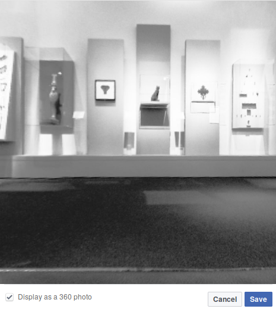
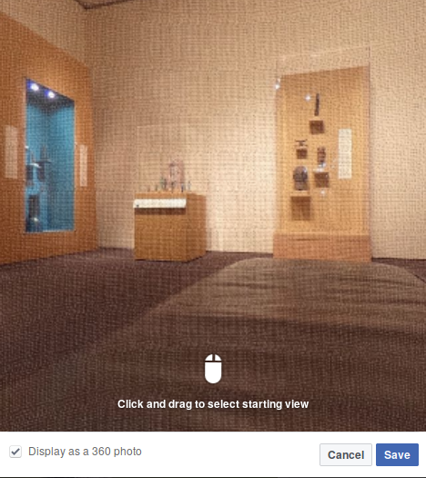
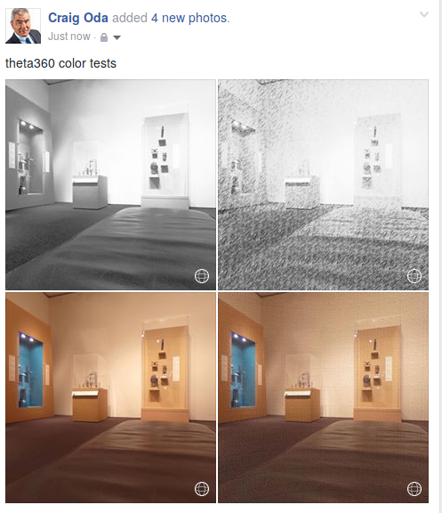

== Color

You can apply color transformations to the THETA image and retain the
360 features.

In this example, I'm using ImageMagick from the command line to
change the image into a black and white 360 image.

  $ convert original.jpg -colorspace Gray  -emboss 0x.5  gray.jpg

image::img/color/grayFacebook2.png[role="thumb" title="360 navigations works after changing color"]

This example shows a command line sketch transformation applied to the 360 image.

image::img/color/sketch2.png[role="thumb" title="pencil sketch applied to THETA image"]

image::img/color/sketch.png[role="thumb" title="navigation works with pencil sketch"]

The actual command is somewhat complex, but you can just copy the command
and replace the file name.

First make a pencil tile. You just need to do this once to generate
a small tile for the pencil.

  convert -size 256x256 xc:  +noise Random  -virtual-pixel tile  -motion-blur 0x20+135 -charcoal 1 -resize 50% pencil_tile.gif

Then apply the command below.

  convert original.jpg -colorspace gray \( +clone -tile pencil_tile.gif -draw "color 0,0 reset" +clone +swap -compose color_dodge -composite \) -fx 'u*.2+v*.8' sketch.jpg

In this example, I'm applying a photo texture with this graphic.

image::img/color/texture_fabric.gif[role="thumb" title="fabric texture tile applied to THETA image"]

The resized image retains 360 navigation.

Here's what the images look like on Facebook.

