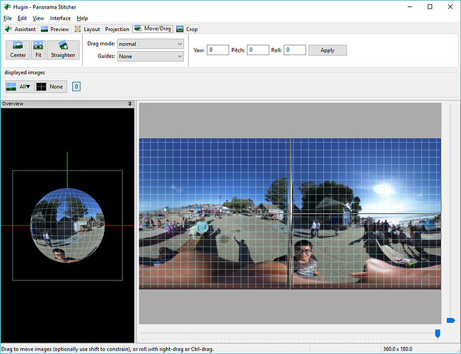
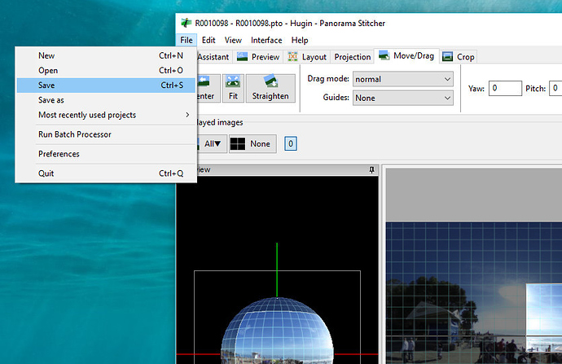
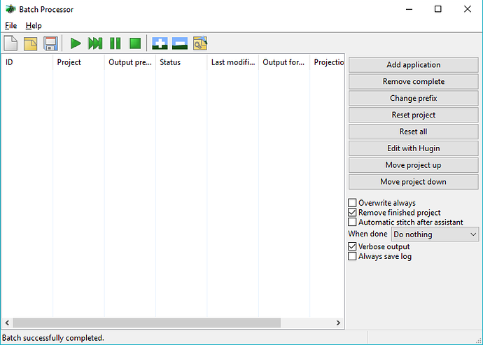
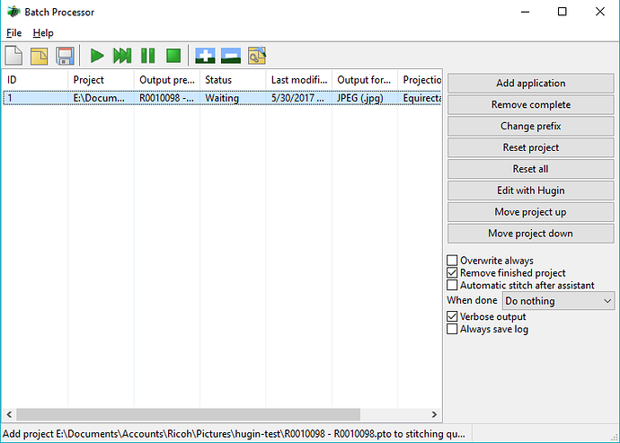
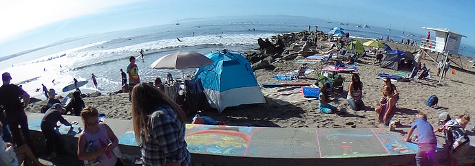
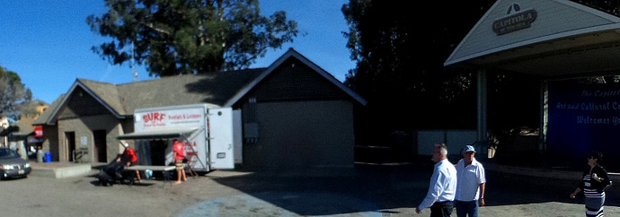

== Crop

Although there are better techniques to get a crop such as using Affinity
Photo, This technique is useful for a quick crop.

=== Original Image Showing Person in Selfie Style

=== Use Move/Drag to View Side Scenery

image::img/crop/move.jpg[role="thumb" title="Move orientation to a section you want to crop"]

=== Crop Scene

image::img/crop/crop1.jpg[role="thumb" title="Selection area to crop"]

=== Save as Flat JPEG File

image::img/crop/scene1.jpg[role="thumb" title="Cropped scene from 360 image"]

=== Details of Steps

==== Save Hugin Project File

==== Start Batch Processor

==== Load Project File

==== Run Batch

image::img/crop/run.png[role="thumb"]

=== Example Crops From Same image

You can rapidly crop multiple signs out that are the same size.
This is a fairly quick technique to produce many crops quickly just
by rotating the sphere and saving the new project file. All three of
these images are made in a few minutes with the crop technique.
It might be useful for surveillance, construction, or
even social media if you reduce the width.

image::img/crop/scene3.jpg[role="thumb"]

