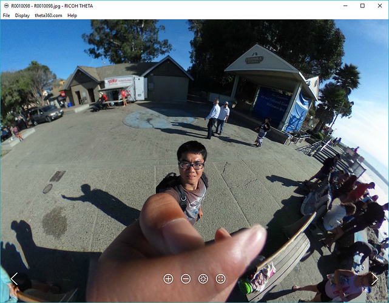
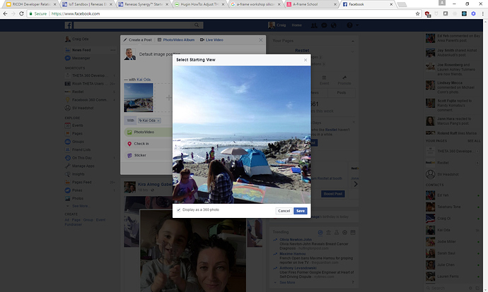
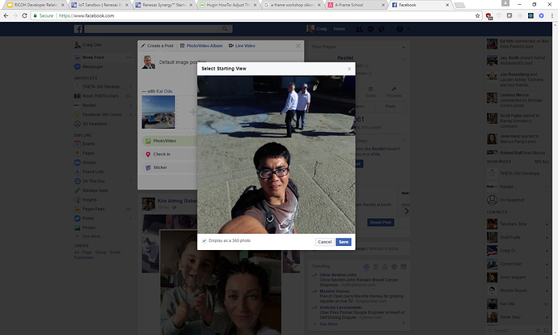
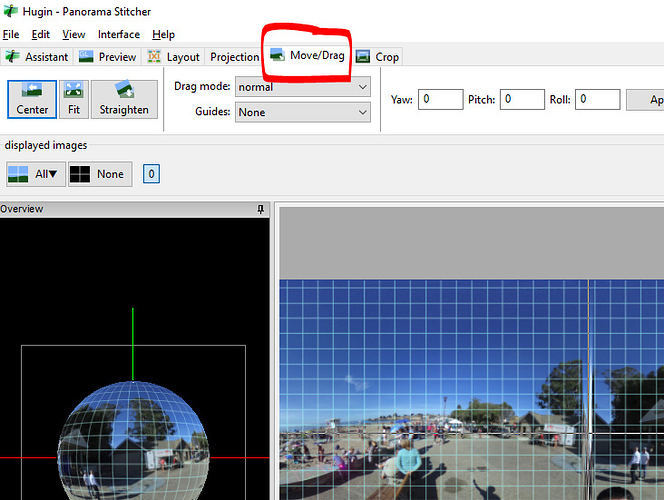
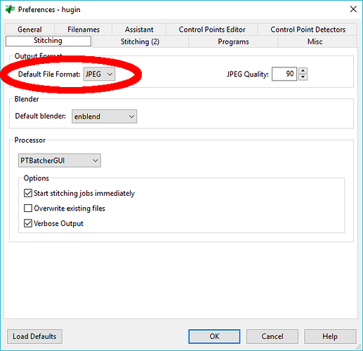
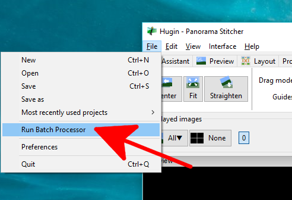
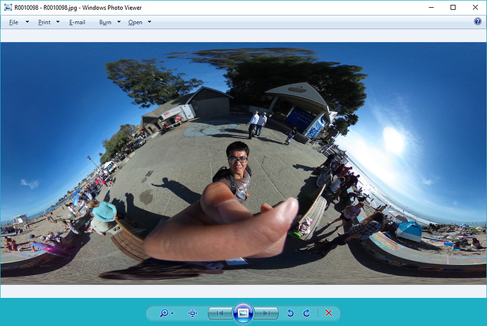

=== Hugin

image::img/hugin/centered.jpg[role="thumb" title="hugin can be used to adjust 360 images"]

There are many ways to fix the tilt of a 360 image. Photoshop can adjust orientation with
http://lists.theta360.guide/t/tutorial-using-photoshop-to-resize-brighten-change-orientation-of-theta-images/1079[offset adjustment].
http://lists.theta360.guide/t/using-360-image-as-flat-image-with-affinity-photo/1249[Affinity Photo]
is also popular. If your viewer supports XMP data, you can edit
the http://lists.theta360.guide/t/getting-360-images-to-work-after-resize-exif-technique/1066[metadata].
For example, in Facebook and most social media applications, simply drag
the default orientation with your mouse.

I will show you a technique to use Hugin. It's not necessarily a best
practice as it's a bit cumbersome. However, this technique may have a
place in your toolbox if your viewer does not support XMP data. This technique
works with any application, even applications that do not support pitch,
yaw, and roll adjustments with XMP data.

==== Starting position of THETA image before editing

image::img/hugin/starting.jpg[role="thumb" title="image starting position"]

==== Starting position of THETA image after editing

==== Facebook Starting Position
To save you time, I'll repeat that you don't need this technique if your
application is uploading a 360 image to Facebook or most social media sites.
Facebook adjusts the XMP data using your mouse to set the default image.

==== Social Media Apps Have Easy Mouse Adjustment

==== Start Hugin

image::img/hugin/huginStart.png[role="thumb" title="Start Hugin"]

==== Drag THETA Image Onto Sphere

image::img/hugin/huginDrag.jpg[role="thumb" title="Drag your THETA image onto Hugin"]

==== Switch to Move/Drag View

==== Left Mouse On Sphere

image::img/hugin/huginMouse.jpg[role="thumb" title="Move sphere with mouse"]

==== Change Default Image Format to JPEG

image::img/hugin/huginPref.png[role="thumb" title="Hugin preferences"]

IMPORTANT: The THETA application can only read in JPEG format files.

==== Save Hugin as *.pto file

image::img/hugin/huginPto.png[role="thumb" title="Save Hugin project"]

==== Select Batch Processing Tool

image::img/hugin/huginBatch2.png[role="thumb" title="batch processing tool"]

==== Select + sign to select Hugin project

image::img/hugin/huginPlus.png[role="thumb" title="Add Hugin project to batch process"]

==== Add Hugin Project File

image::img/hugin/huginProject.png[role="thumb" ]

==== Press Play to Start Batch

image::img/hugin/huginProject.png[role="thumb" ]

==== Edited Image File Saved to Disk

