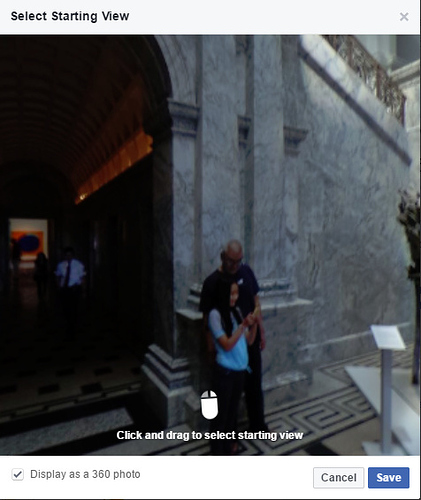
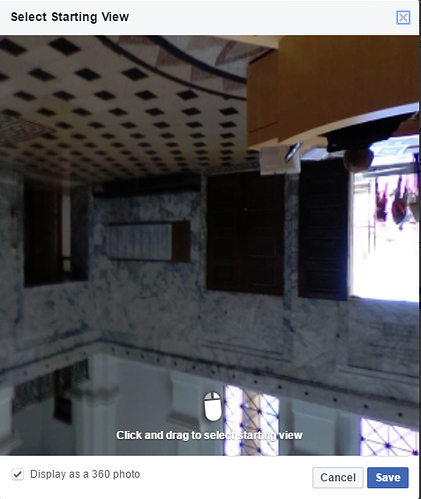
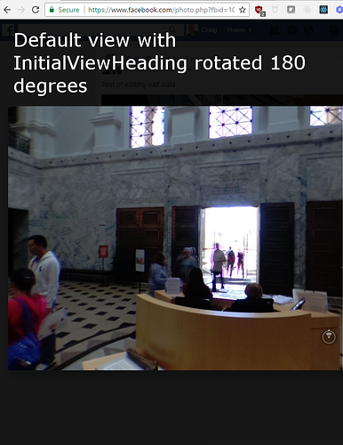
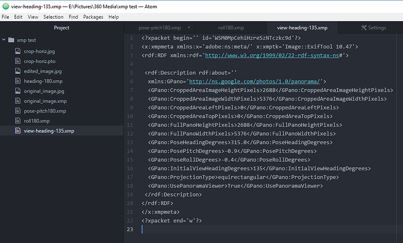
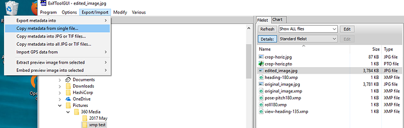

== metadata
RICOH THETA images have
https://en.wikipedia.org/wiki/Exif[EXIF] and
https://developers.google.com/streetview/spherical-metadata[XMP]
metadata embedded into the image files

=== What is Metadata?

360 images have hidden text embedded into the image data.
This data is called metadata. It is not designed for humans. A computer reads in the metadata.

https://developers.google.com/streetview/spherical-metadata[Photo Sphere XMP Metadata]
is a Google standard taken from the Adobe XMP standard. You can edit this data with an image
editor or a text editor. Most 360 image viewers such as Facebook will support XMP data.
As 360 images are still new, not all applications support XMP data.
If the application does not
support XMP data, you will need to edit the entire image with something
link
http://lists.theta360.guide/t/hugin-howto-adjust-theta-image-tilt-and-centering/1270[Hugin]
or Photoshop.

=== Why Use XMP Data?

Editing the XMP data uses less CPU and memory resources. Your application can
change the text string for orientation with
almost no delay for the user of your application. Editing the entire image
orientation with image editing techniques is going to place a heavy load on
the mobile or desktop application.

=== What Can You Edit?

You can edit both the XMP data embedded in the THETA image as well as add new
XMP data tags that comply to the Photo Sphere XMP Metadata standard.
For example, your application can add GPS data as well as initial view data
to the image. The data can then be used by 360 viewing applications
such as Facebook.

=== Overview of Functionality using Facebook as Viewer
This is the same image shown on Facebook with no mouse editing. The
orientation was changed by only using XMP data strings.

==== Default View of Image Before Editing
The original image looks like this on Facebook with no editing.
Although Facebook allows you to set the orientation with their Facebook app,
let's imagine that you're building a better Facebook or building a new
application to support XMP data. Imagine that the mouse is not there.

This is the default XMP data that we'll edit for our tests.

      <GPano:PosePitchDegrees>-0.9</GPano:PosePitchDegrees>
      <GPano:PoseRollDegrees>-0.4</GPano:PoseRollDegrees>

---

====  Pose Pitch Increased by 180 Degrees

Here, I'll increase the PosePitchDegrees by 180 degrees to illustrate the
orientation change. Image the camera is upside and you need to correct the image orientation.

      <GPano:PosePitchDegrees>179.1</GPano:PosePitchDegrees>
      <GPano:PoseRollDegrees>-0.4</GPano:PoseRollDegrees>

==== Pose Roll Increased by 180 Degrees

In the next example, I've increased the Roll by 180 and reset the Pitch to the default value.

      <GPano:PosePitchDegrees>-0.9</GPano:PosePitchDegrees>
      <GPano:PoseRollDegrees>179.6</GPano:PoseRollDegrees>

==== InitialViewHeadingDegrees Decreased by 180

In the next example, I've added a new metadata tag for _InitialViewHeadingDegrees_.
I got the name of the tag from the XMP standard. I've rotated the orientation
by 180 degrees to show the back of the image sphere.

      <GPano:PosePitchDegrees>-0.9</GPano:PosePitchDegrees>
      <GPano:PoseRollDegrees>-0.4</GPano:PoseRollDegrees>
      <GPano:InitialViewHeadingDegrees>135</GPano:InitialViewHeadingDegrees>

=== Metadata Tools

There are a number of free tools and libraries to access the metadata.

* http://www.sno.phy.queensu.ca/~phil/exiftool/[ExifTool by Phil Harvey]
* http://u88.n24.queensu.ca/~bogdan/[ExifToolGUI]
* https://www.thexifer.net/[the eXif.er]

image::img/metadata/exifgui.jpg[role="thumb" title="ExifToolGUI"]

image::img/metadata/exif-data.png[role="thumb" title="metadata viewed with ExifToolGUI"]

You can immediately see useful data in the metadata tags. Many sites, including
Facebook will
https://facebook360.fb.com/editing-360-photos-injecting-metadata/[look]
for a *Make* of *RICOH* and a *Model* of *RICOH THETA S*. You can
use the metadata *Make* and *Model* to see if the image file your
application is opening is a 360 image.

IMPORTANT: The THETA image must also be in a ratio of 2:1. Your application should
check for this ratio in case the image was edited incorrectly in post-processing.

Clicking on the Xmp tab, we'll now get to the real exciting data.

image::img/metadata/xmp_data.png[role="thumb" title="Exciting THETA XMP Data"]

For starters, you can check for the *ProjectionType* of *equirectangular*.
Your application can easily identify an equirectangular image this way.

Below this, you can see the *PoseHeadingDegrees*, *PosePitchDegrees*, and
*PoseRollDegrees*. The THETA camera has internal sensors to get the
heading, pitch and roll.

CAUTION: The user of your application may have edited the image and deleted
the metadata from the image. The solution is to review their post-processing
workflow and then inspect the metadata manually or your application can check it.

Metadata can be injected into a 360 image that has lost the data by graphic
editing tools. Programming libraries can do this, or you can use exiftool
in a script.

 exiftool -ProjectionType="equirectangular" photo.jpg

Here's an
http://lists.theta360.guide/t/getting-360-images-to-work-after-resize-exif-technique/1066[article]
on getting the images to work after resizing the image by
copying the original XMP data and copying over the resized image.

=== Edit XMP Data In Text File

image::img/metadata/exportXmp.png[role="thumb" title="Use ExifToolGui to export XMP data as a text file"]

Import XMP data into THETA image. With the THETA image you want to edit
selected, copy metadata from single file.

=== Exiftool from command line

You can read and edit the XMP data directly from the command line. In the
examples below, I'm using a bash shell on Windows. Many people use
a bash script to control exiftool

==== Reading Data

    $ ./exiftool.exe edited_image.jpg > data.txt
    $ less data.txt

This is the metadata in my data.txt file

  ExifTool Version Number         : 10.47
  File Name                       : edited_image.jpg
  Directory                       : .
  File Size                       : 3.7 MB
  File Modification Date/Time     : 2017:05:31 12:44:39-07:00
  File Access Date/Time           : 2017:05:31 12:44:39-07:00
  File Creation Date/Time         : 2017:05:31 11:31:21-07:00
  File Permissions                : rw-rw-rw-
  File Type                       : JPEG
  File Type Extension             : jpg
  MIME Type                       : image/jpeg
  Exif Byte Order                 : Big-endian (Motorola, MM)
  Image Description               :
  Make                            : RICOH
  Camera Model Name               : RICOH THETA S
  Orientation                     : Horizontal (normal)
  X Resolution                    : 72
  Y Resolution                    : 72
  Resolution Unit                 : inches
  Software                        : RICOH THETA S Ver 1.62
  Modify Date                     : 2016:10:23 12:25:33
  Y Cb Cr Positioning             : Co-sited
  Copyright                       :
  Exposure Time                   : 1/125
  F Number                        : 2.0
  ISO                             : 100
  Sensitivity Type                : Standard Output Sensitivity
  Exif Version                    : 0230
  Date/Time Original              : 2016:10:23 12:25:33
  Create Date                     : 2016:10:23 12:25:33
  Components Configuration        : Y, Cb, Cr, -
  Compressed Bits Per Pixel       : 3.2
  Aperture Value                  : 2.0
  Brightness Value                : 3.5
  Exposure Compensation           : -0.7
  Max Aperture Value              : 2.0
  Metering Mode                   : Multi-segment
  Light Source                    : Unknown
  Flash                           : No Flash
  Focal Length                    : 1.3 mm
  Maker Note Type                 : Rdc
  Firmware Version                : 1.62
  Serial Number                   : (00000000)00010093
  Recording Format                : JPEG
  Accelerometer                   : 359.6 -0.9
  Compass                         : 315
  Time Zone                       : -07:00
  Exposure Program                : Auto
  White Balance                   : Auto
  User Comment                    :
  Flashpix Version                : 0100
  Color Space                     : sRGB
  Exif Image Width                : 5376
  Exif Image Height               : 2688
  Interoperability Index          : R98 - DCF basic file (sRGB)
  Interoperability Version        : 0100
  Exposure Mode                   : Auto
  Scene Capture Type              : Standard
  Sharpness                       : Normal
  GPS Version ID                  : 2.3.0.0
  GPS Latitude Ref                : North
  GPS Longitude Ref               : West
  GPS Altitude Ref                : Above Sea Level
  GPS Time Stamp                  : 19:25:31
  GPS Img Direction Ref           : True North
  GPS Img Direction               : 315
  GPS Map Datum                   : WGS84
  GPS Date Stamp                  : 2016:10:23
  Compression                     : JPEG (old-style)
  Thumbnail Offset                : 58496
  Thumbnail Length                : 3118
  XMP Toolkit                     : Image::ExifTool 10.47
  Cropped Area Image Height Pixels: 2688
  Cropped Area Image Width Pixels : 5376
  Cropped Area Left Pixels        : 0
  Cropped Area Top Pixels         : 0
  Full Pano Height Pixels         : 2688
  Full Pano Width Pixels          : 5376
  Initial View Heading Degrees    : 135
  Pose Heading Degrees            : 315.0
  Pose Pitch Degrees              : -0.9
  Pose Roll Degrees               : -0.4
  Projection Type                 : equirectangular
  Use Panorama Viewer             : True
  Image Width                     : 5376
  Image Height                    : 2688
  Encoding Process                : Baseline DCT, Huffman coding
  Bits Per Sample                 : 8
  Color Components                : 3
  Y Cb Cr Sub Sampling            : YCbCr4:2:2 (2 1)
  Aperture                        : 2.0
  GPS Altitude                    : 36 m Above Sea Level
  GPS Date/Time                   : 2016:10:23 19:25:31Z
  GPS Latitude                    : 37 deg 25' 58.58" N
  GPS Longitude                   : 122 deg 10' 14.32" W
  GPS Position                    : 37 deg 25' 58.58" N, 122 deg 10' 14.32" W
  Image Size                      : 5376x2688
  Megapixels                      : 14.5
  Ricoh Pitch                     : -0.9
  Ricoh Roll                      : -0.399999999999977
  Shutter Speed                   : 1/125
  Thumbnail Image                 : (Binary data 3118 bytes, use -b option to extract)
  Focal Length                    : 1.3 mm
  Light Value                     : 9.0

=== Writing Data

      $ ./exiftool.exe -InitialViewHeadingDegrees=45 edited_image.jpg
          1 image files updated

=== Grab XMP Data with Node

==== Script

  var im = require('imagemagick');
  im.identify('original.jpg', function(err, metadata) {
    if (err) throw err;
    var filtered = {}
    var data = metadata.properties
    for (key in data) {
      if (key.match(/^gpano/)) filtered[key] = data[key];
    }
    console.log(filtered);
  })

==== Output

  $ node nodeMagick.js
  { 'gpano:croppedareaimageheightpixels': '2688',
    'gpano:croppedareaimagewidthpixels': '5376',
    'gpano:croppedarealeftpixels': '0',
    'gpano:croppedareatoppixels': '0',
    'gpano:fullpanoheightpixels': '2688',
    'gpano:fullpanowidthpixels': '5376',
    'gpano:poseheadingdegrees': '180.0',
    'gpano:posepitchdegrees': '2.8',
    'gpano:poserolldegrees': '-0.3',
    'gpano:projectiontype': 'equirectangular',
    'gpano:usepanoramaviewer': 'True' }

=== Zero Out XMP Data with THETA Desktop Application

The THETA desktop application can be used to zero out the pitch and roll so that
your image editing application does not get confused. Problems occur
when the entire image is edited with an image editor and then an application like
Google Street View applies the XMP pitch and roll correction on top of the
editing.

image::img/metadata/xmp_theta_app.png[role="thumb" title="Official THETA Desktop Application saving XMP data"]

After the correction, the XMP data for pitch and roll will be zeroed out.

image::img/metadata/zero-out.png[role="thumb" title="Pitch and Roll are zeroed out by the THETA app"]

IMPORTANT: The orientation of images on an application like Google Streetview will be incorrect
if the user applied correction to some images and not others. They need to apply the adjustment
to all images.

### Libraries

* https://github.com/mayanklahiri/easyexif[easyexif]: C++ EXIF parsing library by http://lahiri.me/[Mayank Lahiri]
* http://www.exiv2.org/[Exiv2]: C++ metadata library and tools by Andreas Huggel
* https://www.codeproject.com/Articles/36342/ExifLib-A-Fast-Exif-Data-Extractor-for-NET[ExifLib] -
A fast EXIF data extractor for .NET by Simon McKenzie
* https://www.npmjs.com/package/imagemagick[Imagemagick module for Noe]

### End User Tools

These tools are for digital artists and support the XMP tags. Many other tools
support the metadata tags.

* http://www.flamingpear.com/flexify-2.html[Flexify 2] Photoshop plug-in
* https://helpx.adobe.com/premiere-pro/how-to/vr-video.html[Adobe Premiere Pro with VR support]
