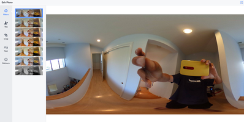

== Orientation and Tilt

The THETA camera contains a gyroscope and compass to determine the position
of the camera. The camera orientation is saved as metadata into the image.

image::img/orientation/sideways.jpg[role="thumb" title="Camera saves orientation data to image"]

image::img/orientation/sideEqui.png[role="thumb" title="Image is sideways"]

Examining the XMP data with exiftool shows the pitch and roll.

  $ exiftool filename.jpg
  Pose Pitch Degrees              : -12.1
  Pose Roll Degrees               : 92.4

When I upload the image to Facebook, the Facebook application reads in
the XMP data and automatically puts the image in the proper orientation.

image::img/orientation/sidewaysFacebook.png[role="thumb" title="Facebook automatically corrects orientation"]

If your application does not automatically adjust the image
orientation based on the camera orientation, you may want to edit the orientation
manually. I'll cover two examples. Povray and Hugin.

By rolling the x axis back by -92.4 degrees, I can display the image upright.

image::img/orientation/correctedCrop.jpg[role="thumb" title="corrected with Povray"]

By using Povray, I've deleted my XMP data and have lost 360 navigation.

If I set ProjectionType to equirectangular, the image will regain 360 navigation
on Facebook.

  $ exiftool -ProjectionType=equirectangular sidewaysCorrected.jpg
      1 image files updated

image::img/orientation/fbWithXmp.png[role="thumb" title="Facebook with after XMP data injection"]

I noticed that povray also flipped my image horizontally. I'm going to flip it back.

  $ convert -flop sidewaysCorrected.jpg flipped.jpg

I'm now going to confirm that the XMP data was retained.

  $ exiftool flipped.jpg |grep Projection
  Projection Type                 : equirectangular

image::img/orientation/flippedImage.png[role="thumb" title="Flipped image retains 360 navigation"]

Now that you have the basics of XMP data and pitch and roll orientation data, let's
have some fun with povray.

include::povray.adoc[]

include::hugin.adoc[]
