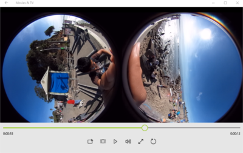
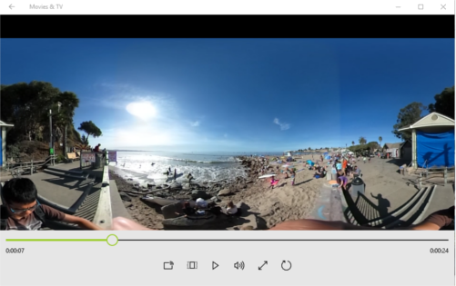
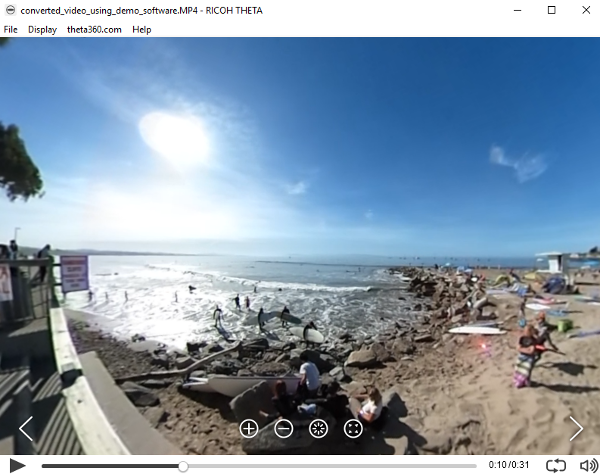

== Overview
This document focuses on still images and videos that are saved to the internal storage
of the camera and transferred to a mobile phone, computer, or device such as
the http://lists.theta360.guide/t/new-sony-playstation-vr-integration-with-ricoh-theta/691?u=codetricity[Sony PlayStation VR].
For information on streaming 360 video from the THETA, see the
http://theta360.guide/community-document/live-streaming.html[Live Streaming Guide].

The video is a standard MP4 file. The image is a standard JPEG file. You can
use tools like Photoshop, Premiere Pro, Paint to edit both the
images and the videos.

The THETA has two lenses. Each lens captures half of a spheres. The two
spheres are placed side by side on media internal to the camera. This image
or video is referred to as dual-fisheye.

Normally, you won't see or deal with media in dual-fisheye format. You will
usually deal with media in equirectangular format.

360 players, such as the RICOH player, YouTube, Facebook, or a VR headset
will take media in equirectangular format and enable navigation.

