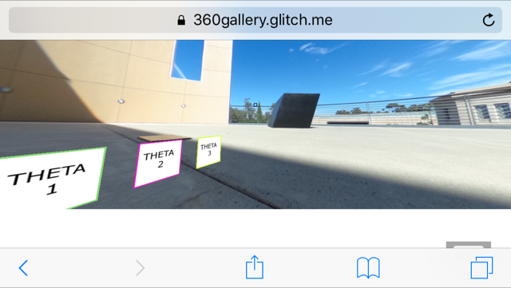
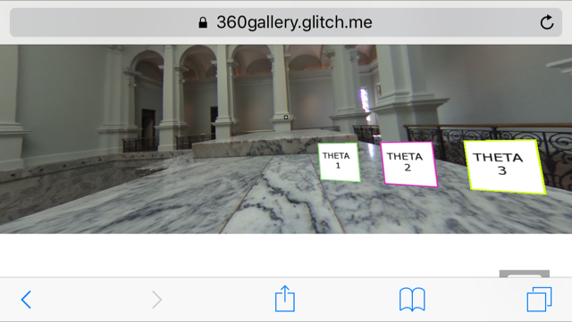
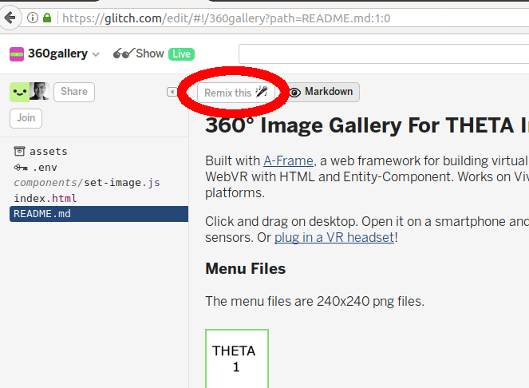
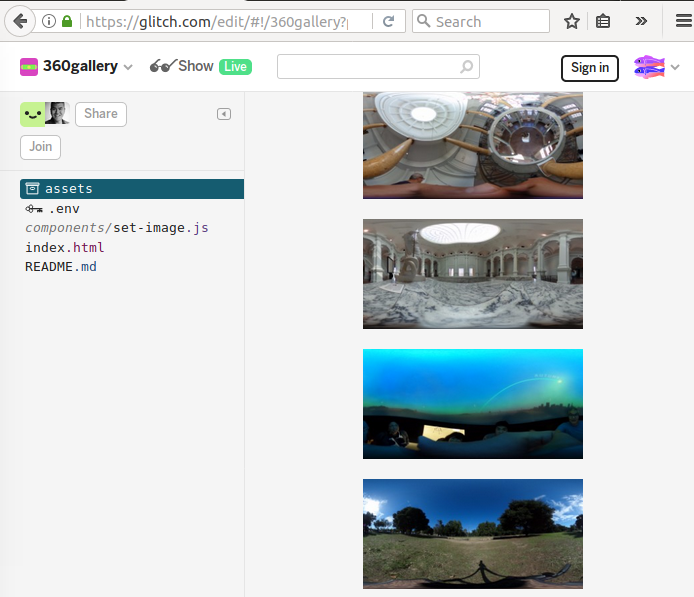

== Web, Headset, and Mobile Platforms

In addition to social media networks like Facebook, Google Street View,
there are a number of tools, frameworks and platforms to share
THETA images and video.

I'll divide the application into three categories:

1. WebVR (Experimental)
2. Unity
3. JavaScript libraries

=== WebVR

WebVR is an experimental specification for JavaScript APIs. For a status update on WebVR, go to
https://webvr.info/[webvr.info]

==== aframe
A-Frame works on web, mobile, and headsets. It's one of the leading
open source frameworks for WebVR.

You can test a THETA 360 Image Gallery by pointing your phone in landscape
mode to https://360gallery.glitch.menew[the sample app]

The example uses Glitch, a collaboration platform for coding web applications.
You can copy and edit the files
https://glitch.com/edit/#!/360gallery[here].

Press _Remix_ to make your own copy of the files.

Under the assets area, drag and drop your THETA images and menu pictures. The
menus are 240x240 pixel images.

=== Google VR
=== Unity
=== Web sites
