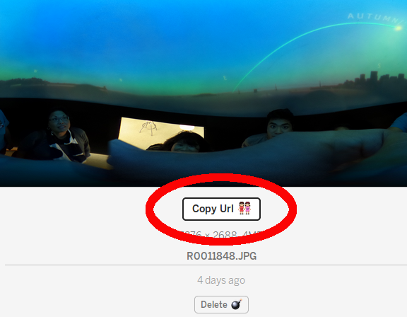

== Web, Headset, and Mobile Platforms

In addition to social media networks like Facebook, Google Street View,
there are a number of tools, frameworks and platforms to share
THETA images and video.

I'll divide the application into three categories:

1. WebVR (Experimental)
2. Unity
3. JavaScript libraries

=== WebVR

WebVR is an experimental specification for JavaScript APIs. For a status update on WebVR, go to
https://webvr.info/[webvr.info]

==== aframe
A-Frame works on web, mobile, and headsets. It's one of the leading
open source frameworks for WebVR.

You can test a THETA 360 Image Gallery by pointing your phone in landscape
mode to https://360gallery.glitch.me[the sample app]

image::img/platform/gallery1.png[role="thumb" title="A-Frame Gallery"]

===== Tutorial to Build A-Frame Application with Glitch

The example uses Glitch, a collaboration platform for coding web applications.

*1. Organize 3 Images for gallery*

Copy 3 images from your camera to a folder on your computer.

*2. Remix Gallery Application on Glitch*

Go to Glitch https://glitch.com/edit/#!/360gallery[here].

Press _Remix_ to make your own copy of the files.

image::img/platform/glitchRemix.png[role="thumb" title="Copying code on Glitch for editing"]

After the remix, your site will have a new name.

*3. Upload THETA Images to Glitch*

Under the assets area, drag and drop your THETA images.

image::img/platform/glitchAssets.png[role="thumb" title="Copy THETA images into Glitch assets area"]

*4. Click on the image to get the URL*

*5. Copy URL Into HTML File*

In the HTML, change the src of the first image, line 18.

  <body>
    <a-scene>
      <a-assets>
        <!-- Sky -->
        

NOTE: optional step is to upload menu pictures. The menus are 240x240 pixel images.

=== Google VR
=== Unity
=== Web sites
