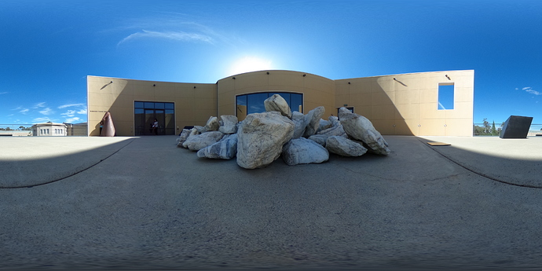
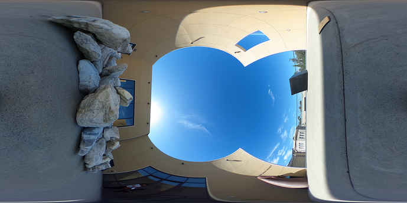
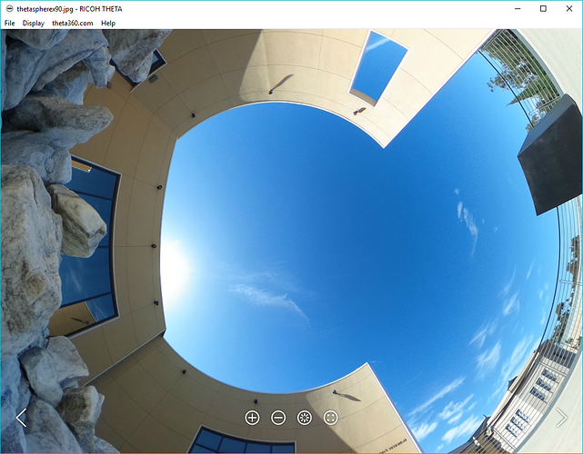
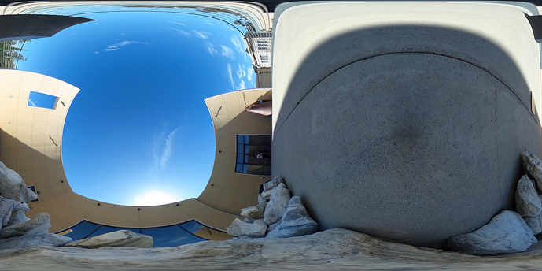
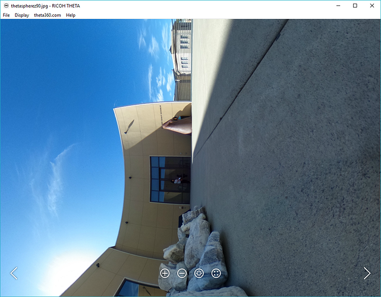

=== Povray

This shows image adjustment by wrapping the THETA
equirectangular image around a sphere in Povray
and then rotating the sphere.

CAUTION: This will delete your XMP data and you may lose 360 navigation.
You may need to inject the ProjectionType metadata back into your image.

Povray is a command line tool that is intended to be used within a
bash script. Alternately, if you're writing your own application, it
may help you to understand the concept of rotating a sphere to make the
proper image adjustment.

Povray reads in a configuration file. The file below specifies a
spherical camera and a texture for the sphere that is an equirectangular
image.

==== .pov configuration file

  #include "colors.inc"
  #include "shapes.inc"

  camera {
  spherical
  }

  sphere {
    // center of sphere
    <0,0,0>, 1
    texture {
      pigment {
        image_map {
          jpeg "museum.jpg"
          interpolate 2
          once
          map_type 1

        }
       }
       rotate z * 90
       // rotate x * 90
       finish { ambient 1}
    }
    }

==== command line

The configuration file above is used by povray on the command line
to output a new file.

  $ povray +W5376 +H2688 +fj  thetasphere.pov +Othetaspherez90.jpg

IMPORTANT: Depending on your application, you may need to inject metadata tags
back into the image that you output with povray. At a minium, you should set
ProjectionType to equirectangular.
