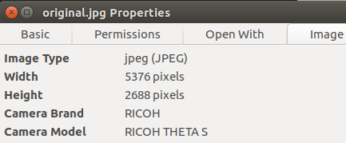
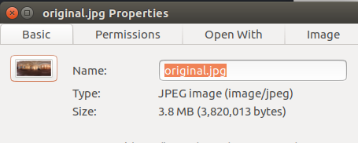
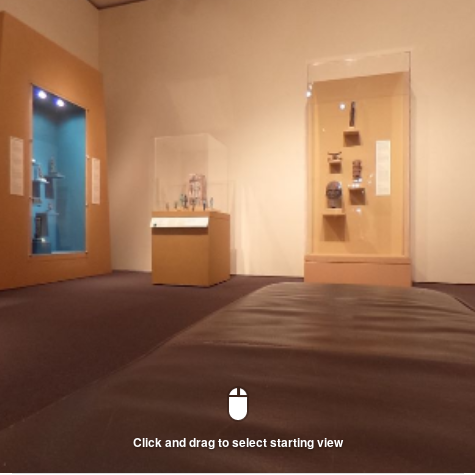
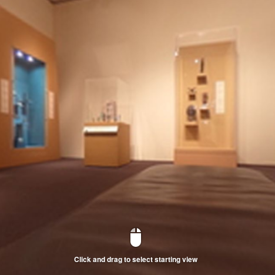

== Resize

You can resize your image as long as it is in ratio of 2:1.

In the example below, I'm using the Linux utility to
https://www.imagemagick.org[ImageMagick]
to resize the image to a low resolution of 800x400.

  $ convert original.jpg -resize 800x400 resized.jpg

I'll verify that the file size was reduced from 3.8M to 0.2M.

  $ ll
  -rw-r--r-- 1 craig craig 3820013 Oct 23  2016 original.jpg
  -rw-r--r-- 1 craig craig  205001 Jun  1 13:51 resized.jpg
  $

TIP: In the example above, I've aliased `ls -l` to `ll`.

Navigation works in the resized image.

I'm using
http://www.sno.phy.queensu.ca/~phil/exiftool/[exiftool] to verify the dimensions of the file.

  $ exiftool resized.jpg |grep 'Image Size'
  Image Size                      : 800x400
