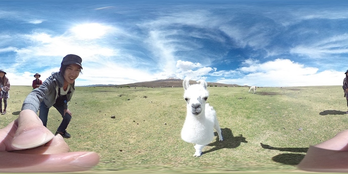

== Sample Application

The sample application
https://github.com/khufkens/theta_rectify[theta_rectify] and
http://lists.theta360.guide/t/theta-s-auto-level-bash-script/1257[post]
 were contributed to the
community by
http://www.khufkens.com/[Dr. Koen Hufkens]
of Harvard University.

My http://virtualforest.io[Virtual Forest] project is
still running strong and generates tons of spherical images
(currently ~50GB). However, the post on which the camera sits is
not perfectly level.  The Theta S camera normally compensates
for this using an internal gyroscope which detects pitch and
roll of the camera.  Yet, when downloading images directly from the
camera no adjustments are made and the pitch and roll data is
merely recorded in the EXIF data of the image.

As such I wrote a small bash script which rectifies (levels the horizon) in Theta S
spherical images using this internal EXIF data. This is an alternative
implementation to the
https://github.com/regen100/thetaexif[THETA EXIF Library] by
https://github.com/regen100[Regen]. I use his cute Lama test images for
reference. All credit for the funky images go to Regen. Below is the quick
install guide to using my script. I hope it helps speed up people's
Theta S workflow.

=== Install
Download, fork or copy paste the script from
https://github.com/khufkens/theta_rectify[my github repository] to your machine
and make it executable.

  $ chmod +x theta_rectify.sh

=== Use

  $ theta_rectify.sh image.jpg

The above command will rectify the image.jpg file and output a new file called image_rectified.jpg.

image::img/sampleapp/original.jpg[role="thumb" title="Original Image"]

Visual comparison between my results and those of
http://www.regentechlog.com/2014/06/26/python-thetaexif/[Regen's python script]
show good correspondence.

=== Requirements
The script depends on a running copy of exiftools, imagemagick and POVRay.
These tools are commonly available in most Linux distros, and can be
installed on OSX using tools such as homebrew. I lack a MS Windows system,
but the script should be easily adjusted to cover similar functionality.

=== Code

  #!/bin/bash
  #
  # Automatically levels Theta S spherical images
  # depends on exiftools / imagemagick and POVRay
  # Should work on most Linux installs and on
  # OSX using homebrew installs or similar

  # get the filename without the extension
  noextension=`echo $1 | sed 's/\(.*\)\..*/\1/'`

  # grab the width and height of the images
  height=`exiftool $1 | grep "^Image Height" | cut -d':' -f2 | sed 's/ //g'`
  width=`exiftool $1 | grep "^Image Width" | cut -d':' -f2 | sed 's/ //g'`

  # grab pitch roll
  roll=`exiftool $1 | grep "Roll" | cut -d':' -f2 | sed 's/ //g'`
  pitch=`exiftool $1 | grep "Pitch" | cut -d':' -f2 | sed 's/ //g'`
  pitch=$(bc <<< "$pitch * -1")

  # flip the image horizontally
  convert -flop $1 tmp.jpg

  # create povray script with correct image parameters
  cat <<EOF > tmp.pov
  // Equirectangular Panorama Render
  // bare bones script
  // camera settings
  camera {
    spherical // equirectangular projection
    up    y * 1
    right  x * image_width / image_height
    location <0,0,0>     // put camera at origin
    angle 360 180        // full image
    rotate x * 0         // Tilt up (+) or down (-)
    rotate y * -90         // Look left (+) or right (-)
    rotate z * 0         // Rotate CCW (+) or CW (-)
  }
  // create a sphere shape
  sphere {
    // center of sphere
    <0,0,0>, 1
    texture {
      pigment {
        image_map {
          jpeg "tmp.jpg"
          interpolate 2 // smooth it
          once   // don't tile image, just one copy
          map_type 1
        }
      }
      rotate x * $roll   //Tilt up (+) or down (-) or PITCH
      rotate y * 0       //shift left (+) or right (-)
      rotate z * $pitch  //Rotate CCW (+) or CW (-) or ROLL
      finish { ambient 1 }
    }
  }
  EOF

  # execute povray script and rename file
  povray +W$width +H$height -D +fj tmp.pov +O${noextension}_rectified.jpg

  # remove temporary files / clean up
  rm tmp.jpg
  rm tmp.pov

=== Explanation
This section added by Craig.

exiftool pulls the orientation from the XMP data. To get the Roll, grep
for the Roll.

  $ exiftool original.jpg |grep Roll
  Pose Roll Degrees               : -0.3
  Ricoh Roll                      : -0.300000000000011

Same for pitch.

  $ exiftool original.jpg |grep "Pitch"
  Pose Pitch Degrees              : 2.8
  Ricoh Pitch                     : 2.8

This line uses ImageMagick to flip the image horizontally.

  convert -flop $1 tmp.jpg

In this section, Koen creates a Povray file.

  # create povray script with correct image parameters
  cat <<EOF > tmp.pov
  // Equirectangular Panorama Render
  // bare bones script

The Povray configuration file is covered in this
http://www.povray.org/documentation/3.7.0/t2_2.html#t2_2[documentation].

The main section of the documentation is below.

      camera {
        location <0, 2, -3>
        look_at  <0, 1,  2>
      }

The camera statement describes where and how the camera sees the scene.
It gives x-, y- and z-coordinates. location <0,2,-3> places the camera
up two units and back three units from the center of the ray-tracing
universe which is at <0,0,0>. By default +z is into the screen
and -z is back out of the screen.

look_at <0,1,2> rotates the camera to point at the coordinates <0,1,2>.
A point 1 unit up from the origin and 2 units away from the origin.
This makes it 5 units in front of and 1 unit lower than the camera.
The look_at point should be the center of attention of our image.

      sphere {
        <0, 1, 2>, 2
        texture {
          pigment { color Yellow }
        }
      }

The first vector specifies the center of the sphere. In this example
the x coordinate is zero so it is centered left and right. It is also at y=1
or one unit up from the origin. The z coordinate is 2 which is five units
in front of the camera, which is at z=-3. After the center vector is
a comma followed by the radius which in this case is two units.
Since the radius is half the width of a sphere, the sphere is
four units wide.
